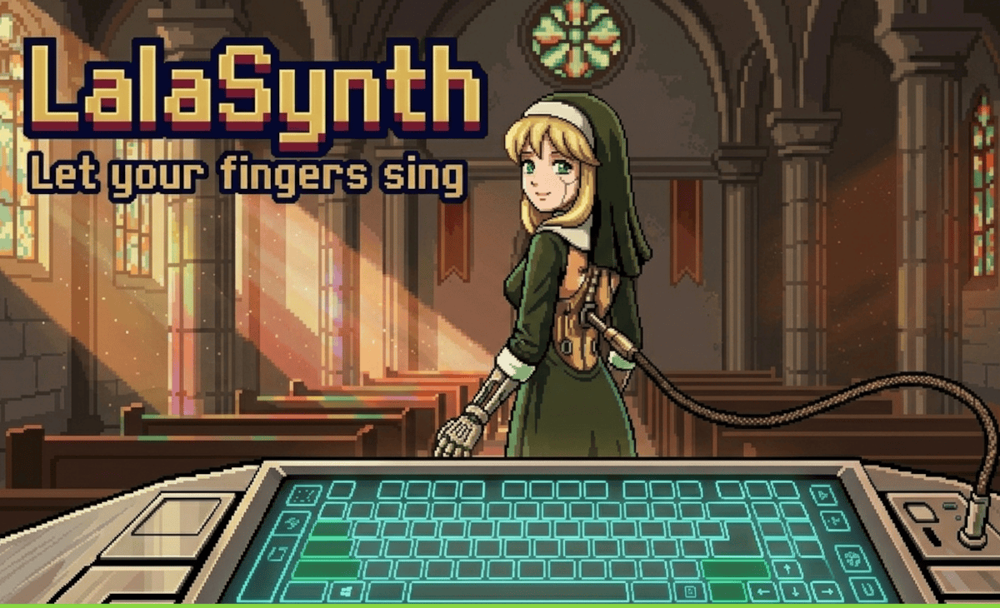

# 🎼 LalaSynth [WIP]

My dear `$user`, since you've lost your voice, I shall be your instrument. Lalasynth is a Svelte and 
Elysia-powered rhythmic game where you pick a YouTube.Music track and outpace others in a typing 
battle royale.

Win to claim your glory and a unique badge for your GitHub profile. Let your fingers sing.

## 💀 MINIMUM SYSTEM REQUIREMENTS

* **🖥️ Operating System:** Windows 11 (24H2) or macOS Sonoma, with mandatory **Hardware-enforced Stack Protection** enabled.
* **🧠 Processor:** Octa-core CPU with **AVX-512** instruction set support (required for real-time procedural emotion synthesis).
* **💾 Memory:** **32 GB RAM**. High-pressure **V8 Garbage Collection** requires at least 16 GB of dedicated overhead to prevent script execution timeouts.
* **🎮 Graphics:** **WebGPU-compliant** hardware with Tier 2 support. Must maintain a constant **Shading Rate** high enough to render 2D sprites without temporal jitter.
* **🌐 Browser:** Chromium-based (Version 124+) with **Experimental Web Features** enabled. Must support **SharedArrayBuffer** and high-precision timers for frame-perfect blinking animations.
* **🗄️ Storage:** 100 GB NVMe Gen5 SSD. The game utilizes **File System Access API** for persistent trauma storage and aggressive asset pre-fetching.
* **⚡ Network:** Low-latency Fiber connection. **WebSockets** must remain open at all times; a disconnect of **>50ms** will result in "character abandonment" and immediate save-file corruption.

---

> **⚠️ WARNING:** Disabling **Hardware Acceleration** in your browser settings is considered a breach of the EULA and may cause your GPU to enter a permanent state of mourning.

## Documentation

- [Adding audio & lyric providers](docs/adding-providers.md)
- [Contributing](docs/CONTRIBUTING.md)
- [Legal Notice — IP & Licensing](docs/LEGAL.md)
- [Disclaimer — Third-Party Content & Copyright](docs/disclaimer.md)